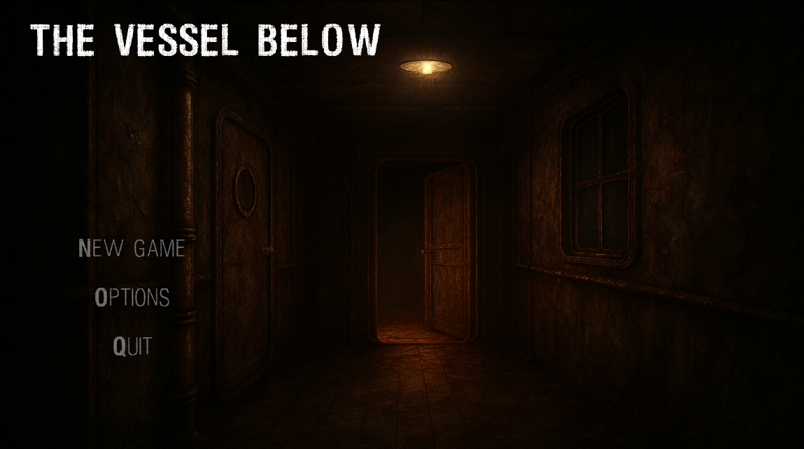
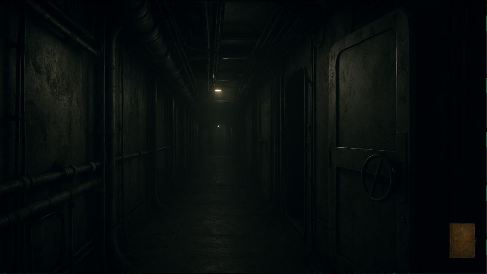
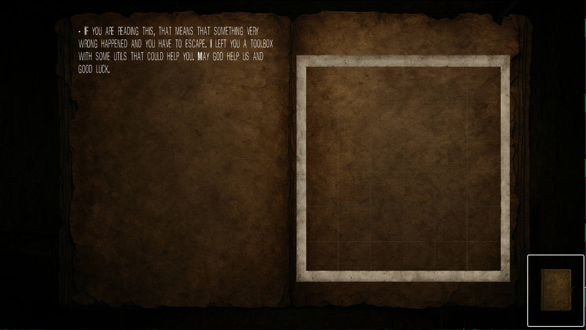
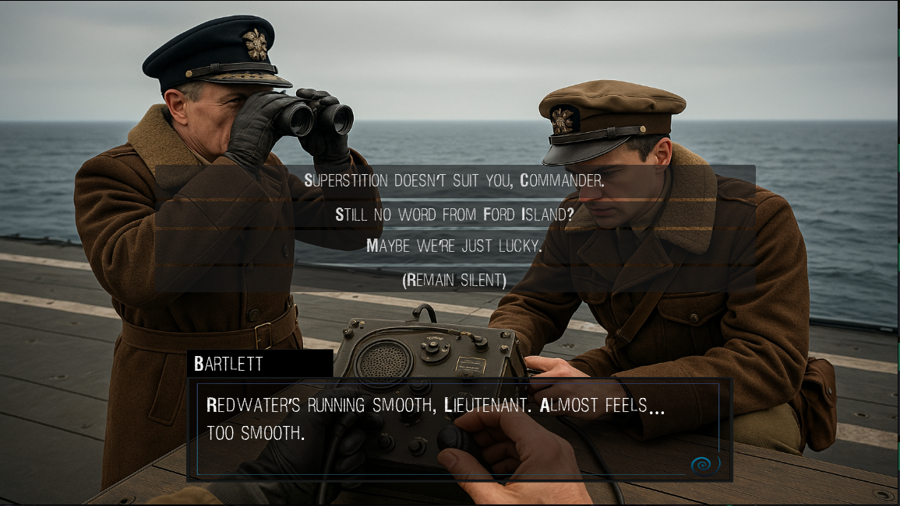

# The Vessel Below

## Context and Project Goal

This project was born at the beginning of the year when I discovered a strong interest in video game creation. The goal is to use the **Godot Engine** to learn how it works and acquire the fundamental skills of game development.

---

## Functional Objectives

- 🎮 Main menu with options
- 🖱️ Point-and-click movement
- 🎧 Immersive visual and audio atmosphere
- 📦 Basic inventory system
- 💬 NPC dialogues
- 📖 Narrative storyline

---

## How to Play

- **Movement**: Click with the mouse to move the character.
- **Interact**: Click on interactive objects or NPCs.
- **Inventory**: Press `I` to open the inventory.

---

## Screenshots

---

## Credits

Project developed individually by **Noa Gonzalez Gomez**.
Assets: Original creations + free-to-use resources (Kenney, OpenGameArt…)

---

## Useful Links

- 📄 [Technical Document](./TECHNICAL_DOC.md)
- 🛠️ [Development Changelog](./STRUCT_CHANGELOG.md)

