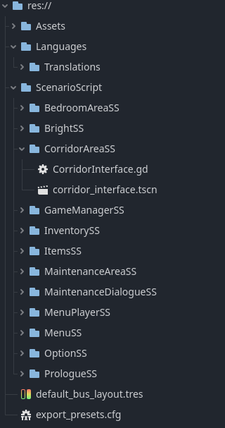

# Technical Document – The Vessel Below

## Tech Stack

- 🎮 Game Engine: Godot
- 🐧 OS: Ubuntu Linux
- 📜 Language: GDScript
- 🎨 Assets: Handmade or free-use resources
- 🧠 Editor: Built-in Godot Editor
- 🧬 Versioning: Git (optional)

---

## Project Structure

- `ScenarioScript/MenuSS/menu_interface.tscn`: Main menu
- `ScenarioScript/OptionSS/options_interface.tscn`: Options menu
- `ScenarioScript/PrologueSS/prologue_interface.tscn`: Game start / first dialogue scene
- `ScenarioScript/BedroomAreaSS/bedroom_interface.tscn`, `ScenarioScript/CorridorAreaSS/corridor_interface.tscn`: Game rooms
- `ScenarioScript/InventorySS/InventoryUI.tscn`, `ScenarioScript/InventorySS/ItemSlot.tscn`: Inventory interface
- `ScenarioScript/MenuPlayerSS/menu_player.tscn`: Sound bus

---

## Key Nodes

- **KinematicBody2D**: Player character
- **Area2D**: Detection zones for interaction
- **Control**: Interfaces (menus, inventory)
- **AnimationPlayer**: Transitions and effects

---

## Core Systems

- 🎒 **Inventory**: Item collection via signals, displayed with `GridContainer`
- 🗣️ **Dialogues**: Text system using `RichTextLabel`, supports player choices
- 🧭 **Navigation**: Click-to-move, obstacle avoidance, target points
- 🎬 **Events**: Trigger zones using `Area2D` and signals

---

## Potential Extensions

- Save system
- Additional rooms and puzzles
- More object and character interactions
- Expanded lore

