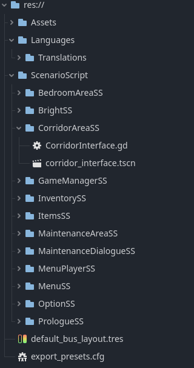

# Technical Document – The Vessel Below

## Tech Stack

- 🎮 Game Engine: Godot v4.5.1.
- 🐧 OS: Ubuntu Linux
- 📜 Language: GDScript
- 🎨 Assets: AImade, Handmade and free-use resources
- 🧠 Editor: Built-in Godot Editor
- 🧬 Versioning: Git

---

## Project Structure

---

## Key Scenes

- `ScenarioScript/MenuSS/menu_interface.tscn` — Main menu interface
- `ScenarioScript/OptionSS/options_interface.tscn` — Options (Brightness, music, video, languages)
- `ScenarioScript/PrologueSS/prologue_interface.tscn` — Prologue dialogue scene
- `ScenarioScript/BedroomAreaSS/bedroom_interface.tscn` — Bedroom area
- `ScenarioScript/CorridorAreaSS/corridor_interface.tscn` — Corridor transition
- `ScenarioScript/InventorySS/InventoryUI.tscn`, `ItemSlot.tscn` — Inventory system
- `ScenarioScript/MenuPlayerSS/menu_player.tscn` — Sound bus & menu audio control
- `ScenarioScript/MaintenanceAreaSS/maintenance_interface.tscn` — New area containing the NPC interaction point.
- `ScenarioScript/MaintenanceDialogueSS/maintenancedialogue_interface.tscn` — New dedicated NPC dialogue scene.

---

## Core Nodes

- **Control** — All interfaces (Menus, inventory, prologue)
- **AnimationPlayer** — Handles fades, transitions, and cutscenes
- **CanvasLayer / ColorRect** — Used for brightness overlay
- **AudioServer** — Handles music volume control
- **Button / Label** — UI interaction and text display
- **RichTextLabel** — Dialogue display with typing effect

---

## Core Systems

### Options System
- Brightness slider with overlay adjustment
- Music slider linked to `Game Music` and `Menu Music` bus
- Video resolution selector (1280x720, 1600x900, 1920x1,080, 2560x1440)
- Language selector cycling through **English**, **Français**, and **Español**

### Language Manager
- Loads `Translations.json` from `Languages/Translations/`
- Updates all UI text dynamically based on selected language
- Integrated into menus, prologue dialogues and item descriptions

### Dialogue System
- Dialogue stored as structured JSON per scene
- Supports branching choices and conditional events
- Prologue dynamically selects dialogue text based on current language

### Inventory System
- Handles pickup, display, and usage of items and notes
- Integrated with world interactions (Items, notes)

### Environmental Interaction
- Objects trigger sound and visual effects
- Flashlight system linked with light overlay
- Automatic hiding of picked objects

### Game Manager
- Centralized control of game state, scene transitions, and player data
- Manages saving/loading of settings and progress
- Coordinates between systems (Dialogue, Inventory, Options)
